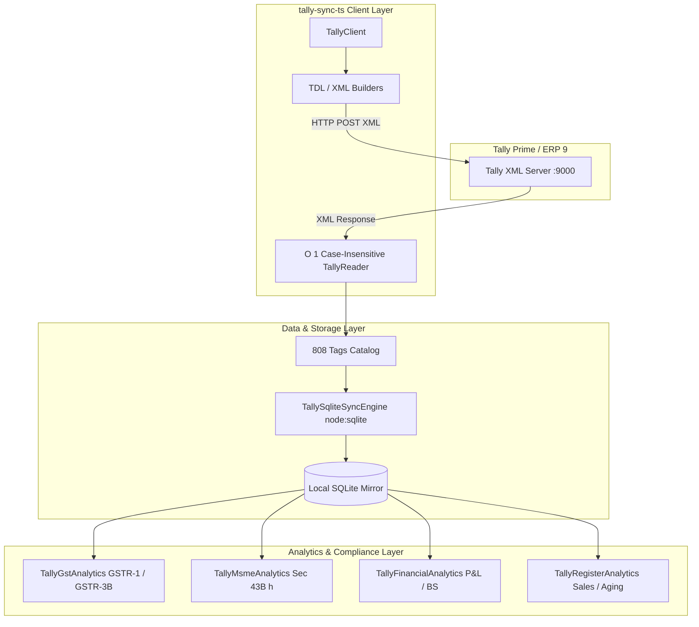

# tally-sync-ts

A production-grade, fully typed TypeScript client and high-speed synchronization engine for **Tally Prime** and **Tally ERP 9** over Tally's native XML/TDL interface.

`tally-sync-ts` provides bidirectional master and voucher synchronization, a catalog of **808 strongly typed Tally XML tags**, a zero-dependency **native SQLite mirror engine** (`node:sqlite`), automated **statutory GST returns (GSTR-1, GSTR-3B)**, **MSME Section 43B(h) compliance reporting**, financial statements, and runtime Zod validation schemas.

---

## Key Features

- **808 Strongly Typed Tally XML Tags**:
  - Full bidirectional type safety across Ledgers, Vouchers, Stock Items, Companies, and Reports.
  - Dedicated typed interfaces for sub-allocations (`BillAllocationTag[]`, `BankAllocationTag[]`, `BatchAllocationTag[]`, `AddressLineTag[]`, `GstRateDetailTag[]`, `InventoryEntryTag[]`, etc.).
  - Zero `Record<string, unknown>` and zero `any` in the type system.
- **Zero-Dependency Native SQLite Mirror Engine (`node:sqlite`)**:
  - High-speed relational database mirror for offline analytical queries and instant reporting.
  - Synchronizes an entire company (companies, groups, ledgers, stock items, vouchers, line items, bill allocations) in milliseconds inside an atomic transaction.
  - Full fidelity: preserves all 808 tags in indexed `raw_tags JSON` columns for custom SQL queries via `json_extract()`.
- **Statutory GST Analytics Suite**:
  - **GSTR-1 Table 4 (B2B Invoices)**: Registered party sales, intra/inter-state tax breakdown (CGST, SGST, IGST), and Place of Supply.
  - **GSTR-1 Table 12 (HSN Summary)**: Aggregated HSN, description, UQC, total quantity, taxable value, and tax rates.
  - **GSTR-3B Tax Summary**: Real outward taxable supply and tax liability calculation derived directly from voucher ledger entries.
  - Native Tally **GST Computation** XML report parser.
- **MSME Section 43B(h) Compliance Engine**:
  - **Creditor Classification**: Categorizes Sundry Creditors into Micro, Small, Medium, or Non-MSME, capturing Udyam Registration Numbers.
  - **Overdue Audit**: Tracks unpaid bills against statutory 15-day (no agreement) and 45-day (with agreement) limits under Section 15 of the MSMED Act.
  - **Tax Disallowance Risk Flag**: Highlights overdue invoices subject to tax disallowance under Section 43B(h) of the Income Tax Act.
  - **Section 16 Compound Interest Calculator**: Automatically computes penal interest at 3 times the RBI Bank Rate compounded monthly.
- **ERP Financial Statements & Operational Registers**:
  - **Profit & Loss**: Gross profit, Cost of Goods Sold, Incomes, Expenses, and Net profit mapped to Tally's 28 standard primary groups.
  - **Balance Sheet**: Capital & Liabilities vs Fixed Assets, Current Assets, and Closing Stock.
  - **Sales Register**: Invoice-by-invoice breakdown of gross values, item rates, discounts, HSN codes, and GST breakdown.
  - **Financial Ratios**: Working Capital, Current Ratio, Quick Ratio, and Days Sales Outstanding (DSO).
  - **Aging Analysis**: Debtors & Creditors aging categorized into standard buckets (`0–30`, `31–60`, `61–90`, and `> 90 days`).
- **Bidirectional CRUD Operations**:
  - Create, Alter, Delete, and Cancel actions for vouchers and masters.
  - Item Invoice, Accounting Invoice, and Journal modes with multi-currency and round-off support.
- **Runtime Validation**:
  - Complete Zod schemas matching all models (`VoucherSchema`, `LedgerSchema`, `StockItemSchema`, `CompanySchema`, etc.).

---

## Architecture



---

## Requirements

- **Node.js**: v22.0.0 or higher (supports native `node:sqlite`).
- **Tally**: Tally Prime (1.0 through 5.x) or Tally ERP 9 with ODBC / HTTP XML enabled on port 9000 (or custom port).

---

## Installation

```bash
npm install github:GreenHacker420/tally-sync-ts
```

Or clone for development:

```bash
git clone https://github.com/GreenHacker420/tally-sync-ts.git
cd tally-sync-ts
npm install
npm run build
```

---

## Quick Start

### 1. Connect and Fetch Masters

```typescript
import { TallyClient } from "tally-sync-ts";

const client = new TallyClient({
  host: "http://localhost",
  port: 9000,
  company: "ACME INDUSTRIES LTD"
});

// Check connectivity
const isConnected = await client.check();
console.log("Connected to Tally:", isConnected);

// Fetch Ledgers with live balances
const ledgers = await client.getObjects("Ledger");
for (const l of ledgers) {
  console.log(`${l.name} | Group: ${l.parent} | Balance: ₹${l.closingBalance}`);
}

// Fetch Stock Items with unit valuations
const stockItems = await client.getObjects("StockItem");
for (const item of stockItems) {
  console.log(`${item.name} | Qty: ${item.closingBalance?.value} ${item.baseUnit} | Value: ₹${item.closingValue?.value}`);
}
```

---

### 2. High-Speed SQLite Mirroring

Mirror all masters and vouchers to an in-memory or persistent SQLite database in milliseconds:

```typescript
import { DatabaseSync } from "node:sqlite";
import { TallyClient, TallySqliteSyncEngine } from "tally-sync-ts";

const client = new TallyClient({ host: "http://localhost", port: 9000, company: "ACME INDUSTRIES LTD" });
const db = new DatabaseSync("tally_mirror.sqlite");
const engine = new TallySqliteSyncEngine(db);

// Pull live data
const [companies, groups, ledgers, stockItems, vouchers] = await Promise.all([
  client.getObjects("Company"),
  client.getObjects("Group"),
  client.getObjects("Ledger"),
  client.getObjects("StockItem"),
  client.getObjects("Voucher", { fromDate: "20250401", toDate: "20260331" })
]);

// Sync atomically
const stats = engine.syncAll({ companies, groups, ledgers, stockItems, vouchers });
console.log(`Synced in ${stats.durationMs}ms:`, stats);

// Execute instant direct SQL queries
const topCustomers = engine.query(`
  SELECT party_ledger_name, COUNT(*) as invoice_count, SUM(amount) as total_revenue
  FROM tally_vouchers
  WHERE voucher_type = 'Sales'
  GROUP BY party_ledger_name
  ORDER BY total_revenue DESC
  LIMIT 5
`);
console.table(topCustomers);
```

---

### 3. Statutory GST Returns (GSTR-1 & GSTR-3B)

Generate filing-grade GST reports derived directly from actual voucher entries and tax ledgers:

```typescript
import { TallyGstAnalytics } from "tally-sync-ts";

const gst = new TallyGstAnalytics(engine);

// 1. GSTR-1 Table 4: B2B Invoices
const b2bInvoices = gst.getGstr1B2B({
  fromDate: "20250401",
  toDate: "20250430"
});
console.table(b2bInvoices);

// 2. GSTR-1 Table 12: HSN Summary
const hsnSummary = gst.getGstr1HsnSummary();
console.table(hsnSummary);

// 3. GSTR-3B Monthly Tax Liability
const gstr3b = gst.getGstr3bSummary();
console.log("Taxable Value : ₹", gstr3b.outwardTaxableSupplies.taxableValue);
console.log("Central Tax   : ₹", gstr3b.outwardTaxableSupplies.cgst);
console.log("State Tax     : ₹", gstr3b.outwardTaxableSupplies.sgst);
console.log("Integrated Tax: ₹", gstr3b.outwardTaxableSupplies.igst);
```

---

### 4. MSME Compliance & Section 43B(h) Reporting

Audit Sundry Creditors against Section 15 & 16 of the MSMED Act and Section 43B(h) of the Income Tax Act:

```typescript
import { TallyMsmeAnalytics } from "tally-sync-ts";

const msme = new TallyMsmeAnalytics(engine);

// 1. Supplier classification (Micro, Small, Medium, Non-MSME)
const suppliers = msme.getMsmeSuppliersSummary();
console.table(suppliers);

// 2. Section 43B(h) Overdue Audit (15/45 days limit)
const overdueBills = msme.getMsme43bOverdueReport({
  asOfDate: "2025-03-31",      // Fiscal year-end cutoff
  customAgreementDays: 45      // Statutory maximum limit
});

for (const bill of overdueBills) {
  if (bill.section43bDisallowanceRisk) {
    console.warn(`⚠️ High Tax Disallowance Risk: Bill ${bill.billNumber} from ${bill.supplierName} (${bill.enterpriseType}) is overdue by ${bill.daysOverdue} days.`);
    console.log(`   Pending Amount: ₹${bill.outstandingAmount} | Penal Interest Liable: ₹${bill.penalInterestLiable}`);
  }
}
```

---

### 5. Financial Statements & Operational Registers

```typescript
import { TallyFinancialAnalytics, TallyRegisterAnalytics } from "tally-sync-ts";

const fin = new TallyFinancialAnalytics(engine);
const reg = new TallyRegisterAnalytics(engine);

// Profit & Loss Statement (Mapped to Tally's 28 Primary Groups)
const pl = fin.getProfitAndLoss();
console.log(`Gross Profit: ₹${pl.grossProfit} | Net Profit: ₹${pl.netProfit}`);

// Balance Sheet
const bs = fin.getBalanceSheet();
console.log(`Total Assets: ₹${bs.applicationOfFunds.total}`);

// Sales Register with exact gross and tax splits
const salesRegister = reg.getSalesRegister();
console.table(salesRegister.slice(0, 10));

// Financial Ratios & DSO
const ratios = reg.getRatioAnalysis();
console.log(`Working Capital: ₹${ratios.workingCapital}`);
console.log(`Current Ratio  : ${ratios.currentRatio}`);
console.log(`Quick Ratio    : ${ratios.quickRatio}`);
console.log(`Debtors DSO    : ${ratios.debtorsTurnoverDays} days`);

// Aging Analysis (0-30, 31-60, 61-90, 90+ days)
const debtorsAging = reg.getAgingAnalysis("receivables");
console.table(debtorsAging);
```

---

### 6. Accessing the 808 Tally XML Tags

Every parsed entity implements `TallyTaggedEntity` and provides full autocompletion across all 808 cataloged XML tags:

```typescript
import type { TallyAllTagsRecord } from "tally-sync-ts";

// First-class normalized properties
console.log(voucher.voucherNumber);
console.log(voucher.date);
console.log(voucher.partyName);

// Direct strongly-typed access to any of the 808 tags:
console.log(voucher.tags.BASICBUYERNAME);
console.log(voucher.tags.DISPATCHDOCNO);
console.log(voucher.tags.IRN);

// Deep Ledger tags:
console.log(ledger.tags.BANKCONFIGIFSC);
console.log(ledger.tags.MSMEREGNUMBER);
console.log(ledger.tags.CREDITLIMIT);

// Universal helper methods:
const buyerGstin = voucher.getString("PARTYGSTIN");
const billList = voucher.getList("BILLALLOCATIONS.LIST");
```

---

### 7. Posting a Sales Invoice to Tally

```typescript
const postResponse = await client.postObjects("Voucher", [
  {
    voucherType: "Sales",
    date: "20250415",
    voucherNumber: "INV-2025-001",
    partyLedgerName: "DEMO CUSTOMER CORP",
    placeOfSupply: "Maharashtra",
    isInvoice: true,
    inventoryAllocations: [
      {
        stockItemName: "INDUSTRIAL CABLE",
        quantity: "100 PCS",
        rate: "500.00/PCS",
        amount: 50000,
        isDeemedPositive: true,
        hsnCode: "8544",
        gstRate: 18
      }
    ],
    ledgerEntries: [
      {
        ledgerName: "DEMO CUSTOMER CORP",
        amount: -59000,
        isDeemedPositive: true,
        isPartyLedger: true
      },
      {
        ledgerName: "SALES GST 18%",
        amount: 50000,
        isDeemedPositive: false
      },
      {
        ledgerName: "CGST 9%",
        amount: 4500,
        isDeemedPositive: false
      },
      {
        ledgerName: "SGST 9%",
        amount: 4500,
        isDeemedPositive: false
      }
    ]
  }
]);

console.log("Post status:", postResponse);
```

---

## Running Tests

The test suite contains 62 automated unit and integration tests verifying XML parsing, serialization, all 808 tags, SQLite mirroring, and GST/MSME report accuracy:

```bash
npm test
```

---

## License

MIT © GreenHacker420
