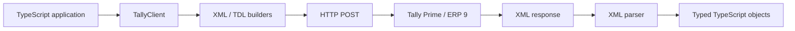

# tally-sync-ts

A typed TypeScript client for reading, writing, and synchronizing data with **Tally Prime** and **Tally ERP 9** through Tally's XML/TDL interface.

`tally-sync-ts` provides a high-level client, strongly typed Tally models, XML builders/parsers, pagination helpers, statistics, GST utilities, raw report access, and an injectable transport layer.

> This repository is source-first. It is not currently documented as an npm-registry release.

## Features

- Typed read/write APIs for Tally masters and vouchers
- Create, alter, delete, and cancel actions through typed models
- Generic typed `getObjects()` and `postObjects()` APIs
- Pagination with total-count metadata
- Master, voucher, and periodic voucher statistics
- GST registration and GST computation support
- Deep voucher parsing/posting:
  - ledger entries
  - bill allocations
  - cost-centre allocations
  - inventory allocations
  - batch allocations
  - accounting allocations
  - GST rate details
  - e-way bill details
- Raw Tally XML request support
- Raw XML parsing helpers
- Custom filters, fetch lists, TDL compute fields, and date ranges
- Injectable transport for testing, proxies, logging, or custom networking
- ESM-first TypeScript output with generated declaration files

## How it works



By default the client connects to:

```text
http://localhost:9000
```

You can change the host, port, timeout, or provide a completely custom `TallyTransport`.

## Requirements

- Node.js 22 or newer
- A reachable Tally Prime or Tally ERP 9 instance
- Tally's XML/HTTP interface available on the configured port
- An active company for company-scoped operations

## Installation

### Install directly from GitHub

```bash
npm install github:GreenHacker420/tally-sync-ts
```

The package runs its TypeScript build during Git installation.

### Clone for development

```bash
git clone https://github.com/GreenHacker420/tally-sync-ts.git
cd tally-sync-ts
npm install
npm run build
```

## Quick start

```typescript
import { TallyClient } from "tally-sync-ts";

const tally = new TallyClient("http://localhost", 9000);

if (!(await tally.check())) {
  throw new Error("Tally is not reachable");
}

const company = await tally.getActiveCompany();

const ledgers = await tally.getLedgers({
  company,
  pageNum: 1,
  recordsPerPage: 100,
});

console.log(company);
console.log(ledgers);
```

The constructor signature is:

```typescript
new TallyClient(baseURL?, port?, timeoutMinutes?, transport?)
```

Defaults:

```typescript
new TallyClient("http://localhost", 9000, 3);
```

## Supported Tally objects

The generic typed APIs currently support the following object types:

| Object | Read | Write | Convenience methods |
|---|:---:|:---:|---|
| Ledger | ✅ | ✅ | `getLedgers`, `postLedgers` |
| Group | ✅ | ✅ | `getGroups`, `postGroups` |
| Company | ✅ | ✅ | `getCompanies`, `postCompanies` |
| Voucher | ✅ | ✅ | `getVouchers`, `postVouchers` |
| CostCentre | ✅ | ✅ | `getCostCentres`, `postCostCentres` |
| CostCategory | ✅ | ✅ | `getCostCategories`, `postCostCategories` |
| VoucherType | ✅ | ✅ | `getVoucherTypes`, `postVoucherTypes` |
| Unit | ✅ | ✅ | `getUnits`, `postUnits` |
| StockGroup | ✅ | ✅ | `getStockGroups`, `postStockGroups` |
| StockCategory | ✅ | ✅ | `getStockCategories`, `postStockCategories` |
| Godown | ✅ | ✅ | `getGodowns`, `postGodowns` |
| StockItem | ✅ | ✅ | `getStockItems`, `postStockItems` |
| Employee | ✅ | ✅ | `getEmployees`, `postEmployees` |
| EmployeeGroup | ✅ | ✅ | `getEmployeeGroups`, `postEmployeeGroups` |
| Currency | ✅ | ✅ | `getCurrencies`, `postCurrencies` |
| GSTRegistration | ✅ | ✅ | `getGSTRegistrations`, `postGSTRegistrations` |
| AttendanceType | ✅ | ✅ | `getAttendanceTypes`, `postAttendanceTypes` |
| Budget | ✅ | ✅ | `getBudgets`, `postBudgets` |

`Write` uses Tally import XML and supports model actions such as `Create`, `Alter`, `Delete`, and `Cancel` where the underlying Tally object supports them.

## Query options

Most read APIs accept `RequestOptions` or `PaginatedRequestOptions`.

```typescript
const ledgers = await tally.getLedgers({
  company: "My Company",
  fromDate: "2026-04-01",
  toDate: "2027-03-31",
  fetchList: ["MasterId", "Name", "Parent", "ClosingBalance"],
  filters: [
    {
      name: "OnlyDebtors",
      formula: '$Parent = "Sundry Debtors"',
    },
  ],
  pageNum: 1,
  recordsPerPage: 250,
});
```

Available options include:

| Option | Purpose |
|---|---|
| `company` | Select the current Tally company |
| `fromDate` / `toDate` | Apply a date range |
| `filters` | Add named TDL filters/formulas |
| `fetchList` | Control native fields fetched from Tally |
| `compute` | Add TDL computed fields |
| `computeVar` | Add TDL compute variables |
| `childOf` | Scope a collection under a parent |
| `belongsTo` | Configure Tally `BELONGSTO` behavior |
| `collectionType` | Override the underlying Tally collection type |
| `pageNum` | Select the requested page |
| `recordsPerPage` | Set page size |
| `disableCountTag` | Skip count metadata where supported |

## Generic typed API

Use the generic methods when you do not need an object-specific convenience method.

```typescript
const groups = await tally.getObjects("Group", { company });

const result = await tally.postObjects(
  "Ledger",
  [
    {
      name: "Demo Customer",
      group: "Sundry Debtors",
    },
  ],
  { company }
);
```

The object name determines the TypeScript model returned or accepted by the generic API.

## Pagination

`getPaginatedObjects()` performs a count request and returns page metadata with the parsed objects.

```typescript
import type { Ledger } from "tally-sync-ts";

const page = await tally.getPaginatedObjects<Ledger>("Ledger", {
  company,
  pageNum: 2,
  recordsPerPage: 100,
});

console.log({
  page: page.pageNum,
  totalPages: page.totalPages,
  totalCount: page.totalCount,
  records: page.objects.length,
});
```

## Posting vouchers

```typescript
import type { Voucher } from "tally-sync-ts";

const voucher: Voucher = {
  date: "2026-08-13",
  voucherType: "Sales",
  voucherNumber: "INV-1001",
  partyName: "Acme Customer",
  partyGSTIN: "27ABCDE1234F1Z5",
  placeOfSupply: "Maharashtra",
  isInvoice: true,

  ledgerEntries: [
    {
      ledgerName: "Acme Customer",
      amount: 1180,
      isDeemedPositive: true,
      isPartyLedger: true,
      billAllocations: [
        {
          name: "INV-1001",
          billType: "New Ref",
          amount: 1180,
        },
      ],
    },
  ],

  inventoryAllocations: [
    {
      stockItemName: "Widget",
      quantity: "10 pcs",
      rate: "100/pcs",
      amount: 1000,
      isDeemedPositive: false,
      batchAllocations: [
        {
          godownName: "Main Location",
          batchName: "B1",
          actualQuantity: "10 pcs",
          billedQuantity: "10 pcs",
          amount: 1000,
        },
      ],
      accountingAllocations: [
        {
          ledgerName: "Sales",
          amount: -1000,
          isDeemedPositive: false,
        },
      ],
      gstRateDetails: [
        {
          dutyHead: "CGST",
          valuationType: "Based on Value",
          rate: 9,
        },
      ],
    },
  ],

  ewayBillDetails: {
    transporterName: "Fast Transport",
    vehicleNumber: "MH01AB1234",
  },
};

const result = await tally.postVouchers([voucher], { company });
console.table(result);
```

## Create, alter, delete, and cancel

Models derived from `BaseTallyObject` support an optional `action`:

```typescript
await tally.postLedgers(
  [
    {
      name: "Old Customer",
      group: "Sundry Debtors",
      action: "Delete",
    },
  ],
  { company }
);
```

For existing objects, the builders can also infer `Alter` from `masterId` where supported.

For vouchers:

```typescript
await tally.postVouchers(
  [
    {
      date: "2026-08-13",
      voucherType: "Sales",
      voucherNumber: "INV-1001",
      action: "Cancel",
    },
  ],
  { company }
);
```

## GST

### GST registrations

```typescript
const registrations = await tally.getGSTRegistrations({ company });

await tally.postGSTRegistrations(
  [
    {
      name: "Maharashtra GST",
      stateName: "Maharashtra",
      gstin: "27ABCDE1234F1Z5",
      registrationDetails: [
        {
          applicableFrom: "2026-04-01",
          gstRegistrationType: "Regular",
          state: "Maharashtra",
          placeOfSupply: "Maharashtra",
        },
      ],
    },
  ],
  { company }
);
```

### GST computation

```typescript
const report = await tally.getGSTComputation({
  company,
  fromDate: "2026-04-01",
  toDate: "2026-06-30",
});
```

`getGSTComputation()` is a convenience wrapper over the generic native-report API.

## Statistics and sync metadata

```typescript
const alterIds = await tally.getLastAlterIds({ company });
const masterStats = await tally.getMasterStatistics({ company });
const voucherStats = await tally.getVoucherStatistics({ company });
const ledgerCount = await tally.getObjectsCount("Ledger", { company });

const monthlyVoucherStats = await tally.getPeriodicVoucherStatistics("Month", {
  company,
  fromDate: "2026-04-01",
  toDate: "2027-03-31",
});
```

`getLastAlterIds()` is useful when building incremental synchronization workflows because it exposes the latest master and voucher alteration IDs reported by Tally.

## Native reports

Fetch an arbitrary Tally report by report name/ID:

```typescript
const report = await tally.getReport("GSTComputation", {
  company,
  fromDate: "2026-04-01",
  toDate: "2026-06-30",
});
```

The response is parsed into the raw JavaScript object produced by `fast-xml-parser`.

## Raw XML

Send a raw request when the high-level API does not cover a Tally feature:

```typescript
const responseXml = await tally.sendRequest(xml, "Custom Tally Request");
```

Parse saved or custom Tally collection XML:

```typescript
import { parseExportCollection, type Voucher } from "tally-sync-ts";

const vouchers = parseExportCollection<Voucher>(xmlString, "Voucher");
```

For lower-level work, the package also exports XML builders, parsing utilities, constants, and TypeScript models from its root entry point.

## Custom transport

Implement `TallyTransport` to proxy requests, mock Tally in tests, add tracing, or use a different networking layer.

```typescript
import {
  TallyClient,
  type TallyTransport,
} from "tally-sync-ts";

class LoggingTransport implements TallyTransport {
  async send(xml: string, requestType?: string): Promise<string> {
    console.log(requestType, xml);

    const response = await fetch("http://localhost:9000", {
      method: "POST",
      headers: {
        "Content-Type": "application/xml; charset=utf-8",
      },
      body: xml,
    });

    if (!response.ok) {
      throw new Error(`Tally returned HTTP ${response.status}`);
    }

    return response.text();
  }
}

const tally = new TallyClient(
  "http://localhost",
  9000,
  3,
  new LoggingTransport()
);
```

## Public exports

The package root exposes:

- `TallyClient`
- all public models and option types from `types.ts`
- Tally constants such as `VOUCHER_TYPES` and `PERIODICITY`
- `TallyTransport` and `FetchTallyTransport`
- XML utility functions
- supported XML request builders
- raw XML/statistics parsers
- `parseExportCollection()`

## Project structure

```text
src/
├── client.ts       High-level typed Tally client
├── constants.ts    Tally constants and reusable TDL functions
├── index.ts        Public package exports
├── transport.ts    Default fetch transport and transport interface
├── types.ts        Tally models and request/response types
├── xmlBuilder.ts   Tally XML/TDL request builders
├── xmlParser.ts    Tally XML response parsers
└── xmlUtils.ts     XML, date, boolean, amount, and normalization helpers

examples/
├── example.ts
├── gstRegistration.ts
├── paginatedAndPosting.ts
├── parserUsage.ts
├── testConnection.ts
├── testGSTReturnsRaw.ts
└── testStatsRaw.ts

tests/
└── client.test.ts
```

## Development

```bash
npm install
npm run build
npm test
```

The default test command runs the self-contained unit/parser/client tests. The repository also contains a compatibility test that references XML fixtures from the upstream C# `TallyConnector` project; that external-fixture test is excluded from the default test command.

A live Tally server is **not** required for the default automated test suite.

Run the interactive example against a local Tally instance with:

```bash
npm run example
```

## Behavioral reference

The XML envelopes, TDL patterns, and model coverage were developed with the open-source C# [Accounting-Companion/TallyConnector](https://github.com/Accounting-Companion/TallyConnector) project as an important behavioral reference.

`tally-sync-ts` keeps its public API idiomatic to TypeScript rather than reproducing C# source-generator or analyzer internals.

## Notes

Tally's XML/TDL behavior can differ by product/version, enabled features, company configuration, and the requested object/report. When integrating a new object or statutory report, validate the generated XML against the Tally version you deploy with.

## License

MIT
